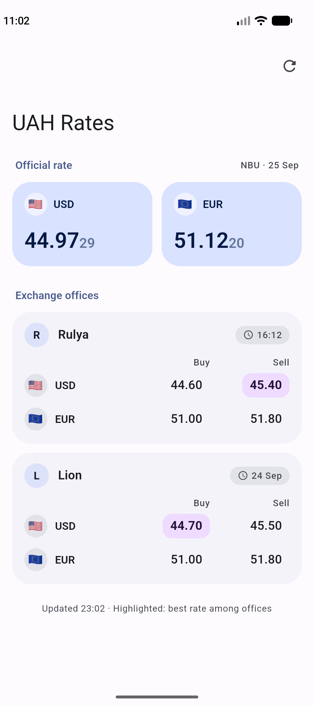
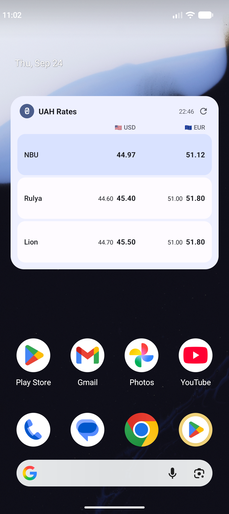

# UAH Rates

USD and EUR exchange rates against the Ukrainian hryvnia, in one app and one home-screen widget.

<br clear="left">

The app shows the official **NBU** rate alongside the buy/sell rates of two Rivne exchange offices, **[Rulya](https://rulya-bank.com.ua)** and **[Lion](https://lion-kurs.rv.ua)**, and highlights the best office rate. The Android widget refreshes in the background every ~15 minutes and keeps showing the last known rates when offline.

<p align="center">
  
  &nbsp;&nbsp;
  
</p>

## Features

- Official NBU rate plus buy/sell rates from Rulya and Lion
- Best buy and sell rate among the offices highlighted
- Resizable widget: full USD + EUR table, or compact USD-only
- Tap ⟳ on the widget to refresh, tap anywhere else to open the app
- Material You colors from the wallpaper, light and dark mode

## Run

```powershell
flutter pub get
flutter run                 # on a connected device or emulator
flutter build apk --release # APK for installing on a phone
flutter test                # parser and widget-text tests
```

Android only for now. The iOS widget needs a Mac (WidgetKit/SwiftUI).

## How it works

| Source | Data |
|---|---|
| NBU | Official JSON API (`bank.gov.ua/NBUStatService`) |
| Rulya, Lion | Rates parsed from the websites' HTML tables |

Parsers live in `lib/sources/parsers.dart` and are tested against saved pages in `test/fixtures/`. If a site changes its layout, that source falls back to its last cached rates and shows a stale marker.

> Not affiliated with NBU, Rulya or Lion. Rates are for information only.
